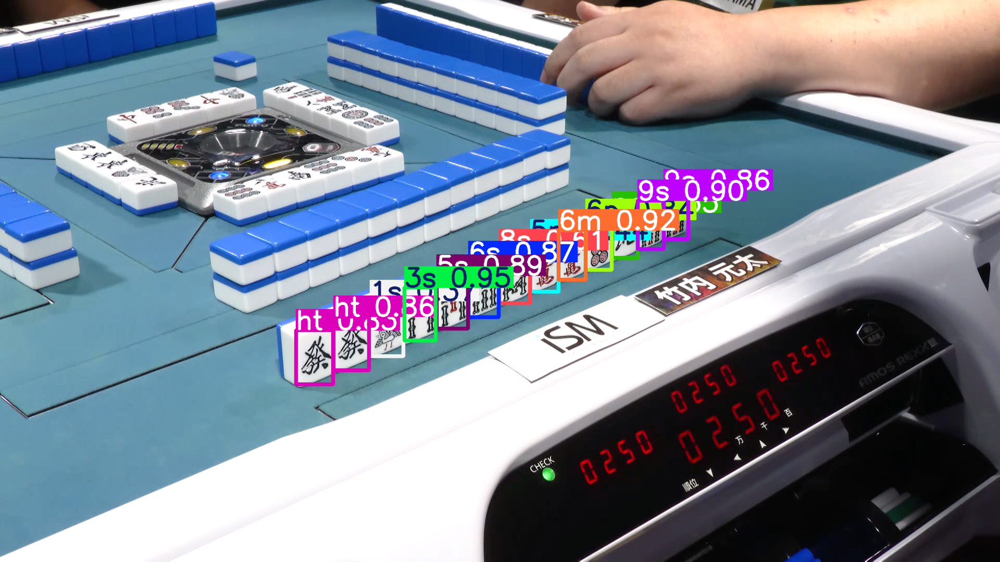
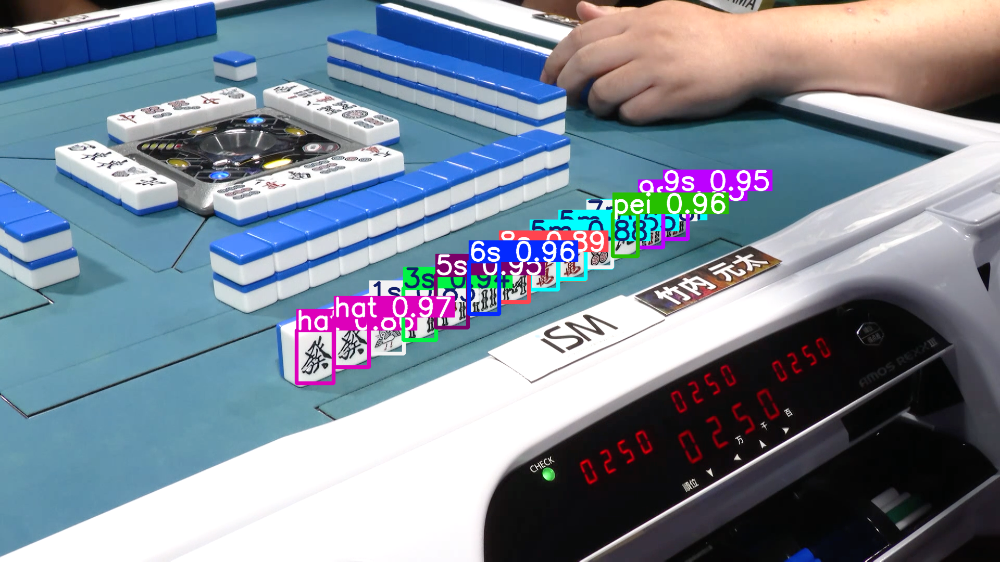

# 麻雀手牌解析

icyng、2025/07/15

---

## 概要

- 画像認識を利用して手牌画像から牌情報を抽出し、点数計算まで行う
- 現状、卓情報（アガリ牌・ドラ・副露）は手入力
- 今後、天井カメラによる、卓上の捨牌・ドラ・副露の解析

### todo

```bash
pip-review --auto
pip install -e . 
```

### SAMPLE

##### YOLOv12m



```bash
Class: ht, Confidence: 0.832
Class: ht, Confidence: 0.863
Class: 1s, Confidence: 0.365
Class: 3s, Confidence: 0.948
Class: 5s, Confidence: 0.889
Class: 6s, Confidence: 0.872
Class: 8s, Confidence: 0.612
Class: 5m, Confidence: 0.435
Class: 6m, Confidence: 0.923
Class: 6p, Confidence: 0.842
Class: pe, Confidence: 0.550
Class: 9s, Confidence: 0.896
Class: 9s, Confidence: 0.856
```

##### YOLOv8n



```bash
Class: ht, Confidence: 0.865
Class: ht, Confidence: 0.967
Class: 1s, Confidence: 0.834
Class: 3s, Confidence: 0.939
Class: 5s, Confidence: 0.949
Class: 6s, Confidence: 0.962
Class: 8s, Confidence: 0.893
Class: 5m, Confidence: 0.881
Class: 6m, Confidence: 0.463
Class: 5m, Confidence: 0.651
Class: 5m, Confidence: 0.344
Class: 7p, Confidence: 0.482
Class: pe, Confidence: 0.956
Class: 9s, Confidence: 0.825
Class: 9s, Confidence: 0.955
```
