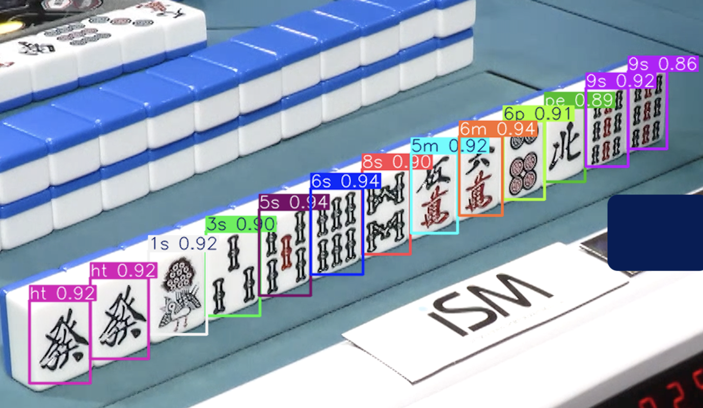

# 麻雀手牌解析

icyng、2025/07/15

---

## 概要

- 画像認識を利用して手牌画像から牌情報を抽出し、点数計算まで行う
- 現状、卓情報（アガリ牌・ドラ・副露）は手入力
- 今後、天井カメラによる、卓上の捨牌・ドラ・副露の解析

### todo

```bash
pip-review --auto
pip install -e . 
```

### SAMPLE(YOLOv12m)



```bash
# 左から順に
Class: 9s, Confidence: 0.864
Class: 8s, Confidence: 0.870
Class: 7s, Confidence: 0.926
Class: 2p, Confidence: 0.899
Class: 4p, Confidence: 0.915
Class: 5p, Confidence: 0.933
Class: 5p, Confidence: 0.924
Class: 7p, Confidence: 0.931
Class: 8p, Confidence: 0.895
Class: 9p, Confidence: 0.939
Class: 9m, Confidence: 0.900
Class: 9m, Confidence: 0.901
Class: 0p, Confidence: 0.904
---
待ち：['3p']

@自家手牌 : ['987', '245578903', '99', '']
@アガリ牌 : 3p
@ツモ : 5翻 40符 2000 4000
@役 : [Menzen Tsumo, Riichi, Dora 3]
@符詳細 : 
{'fu': 20, 'reason': 'base'}
{'fu': 8, 'reason': 'closed_terminal_pon'}
{'fu': 2, 'reason': 'kanchan'}
{'fu': 2, 'reason': 'tsumo'}
```
