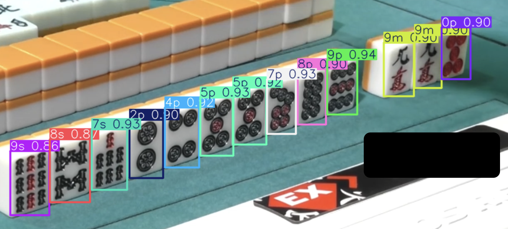

# 麻雀手牌解析ツール

画像認識を利用して手牌画像から牌情報を抽出し、点数計算まで行います

## ⚠️ Warning

macOS での動作を想定しているため、Windows の場合は以下を遵守してください：

```
> python --version
3.10.8

> uv pip list
torch==2.7.1+cu118
torchaudio==2.7.1+cu118
torchvision==0.22.1+cu118
```

## Setup

`uv` を用いて依存関係を管理します

```bash
uv sync
uv pip install -e .
```

## SAMPLE(YOLOv12m)



```bash
> uv run usage.py

...

待ち：['3p']

@自家手牌 : ['987', '245578903', '99', '']
@アガリ牌 : 3p
@ツモ : 5翻 40符 2000 4000
@役 : [Menzen Tsumo, Riichi, Dora 3]
@符詳細 : 
{'fu': 20, 'reason': 'base'}
{'fu': 8, 'reason': 'closed_terminal_pon'}
{'fu': 2, 'reason': 'kanchan'}
{'fu': 2, 'reason': 'tsumo'}
```
